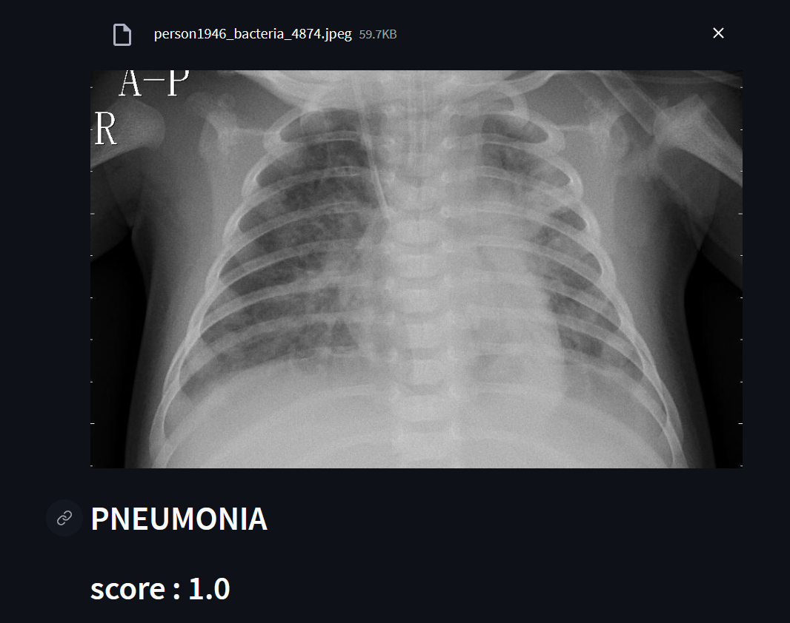

# Pneumonia Classification

This is a Python script for classifying chest X-ray images to detect pneumonia using Torch Lightning. It is built using Streamlit and Keras.

## Getting Started

To run this script, follow the steps below:

1. Install the required dependencies by running the following command:
pip install streamlit keras Pillow

kotlin
Copy code

2. Download the trained model and class labels files and place them in the `model` directory:
- [pneumonia_classifier.h5] (trained Keras model)
- [labels.txt] (list of class labels)

1. Run the script by executing the following command:
```
streamlit run main.py
```

## Usage

1. The script will launch a Streamlit app.

2. Upload an image of a chest X-ray using the file uploader.

3. The app will display the uploaded image and classify it using the trained model.

4. The predicted class and confidence score will be shown below the image.

## Requirements

```
- numpy==1.23.5
- streamlit==1.22.0
- Pillow==9.5.0
- keras==2.12.0
- tensorflow==2.12.0
```
## Acknowledgments

- The trained model used in this script is based on the [pneumonia-chestxray](link_to_dataset) dataset.

```utils.py```


# Utility Functions

This Python module provides utility functions used in the `main.py` script for classifying chest X-ray images.

## Functions

### set_background(image_file)

This function sets the background of a Streamlit app to the specified image.

- `image_file` (str): The path to the image file to be used as the background.

### classify(image, model, class_names)

This function takes an image, a trained machine learning model, and a list of class names, and returns the predicted class and confidence score of the image.

- `image` (PIL.Image.Image): An image to be classified.
- `model` (tensorflow.keras.Model): A trained machine learning model for image classification.
- `class_names` (list): A list of class names corresponding to the classes that the model can predict.

Returns a tuple of the predicted class name and the confidence score for that prediction.

# Output 

